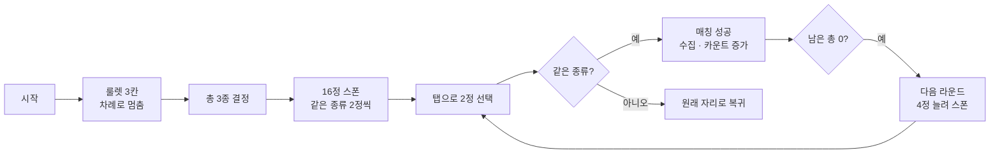
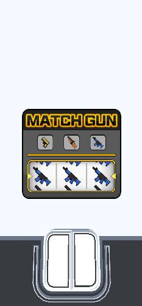
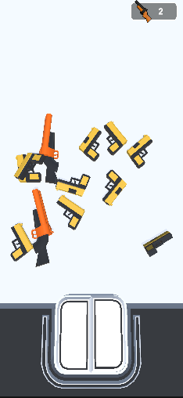
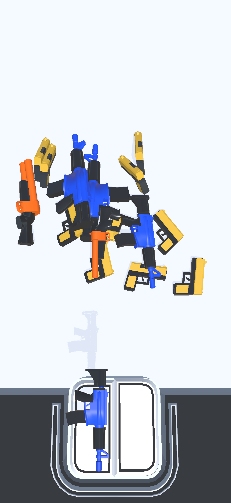

# Match Gun 3D

제한 시간 안에 같은 총을 두 개씩 짝지어 모으고, 모은 총으로 달리는 모바일 하이퍼캐주얼 게임

**투입 이후 글로벌 서비스 흑자 전환 · 매출 15만 달러** · MondayOFF 출시(2023.05) · [App Store](https://apps.apple.com/kr/app/match-gun-3d/id6449533593)

| 항목 | 내용 |
|---|---|
| 기간 | 2023.05 ~ 2023.08 (3개월) |
| 팀 | 2인: Client Developer(본인) · Designer |
| 담당 | 기획 설계(메인), 클라이언트 기능 구현, 인게임 플레이 루프 개편, 출시 후 유지보수 |
| 플랫폼 | iOS · Android |
| 엔진 | Unity 2021.3 LTS (원본 프로젝트 기준) |
| 성과 | 투입 이후 글로벌 서비스 흑자 전환, 매출 15만 달러 (출시작 14종 중 최대 매출) |

> **이 저장소의 범위**: 게임 전반부인 **매칭 파트의 C# 코드**를 포트폴리오용으로 옮겼습니다. 후반부 러닝 파트는 포함하지 않습니다.
> 유료 에셋·아트·사운드·씬은 라이선스와 저작권 때문에 제외했으며, 그래서 이 저장소만으로는 실행되지 않습니다.

<br>

## 1. 핵심 메커니즘: 룰렛 → 스폰 → 매칭

시작하면 룰렛 3칸이 차례로 멈추며 이번 판에 나올 총 3종을 정합니다. 그 총들이 바닥에 짝수로 쏟아지고, 플레이어는 같은 총 두 개를 골라 짝을 맞춥니다.



| 단계 | 동작 | 코드 |
|---|---|---|
| 룰렛 | 3칸이 각각 12·17·22장의 총 이미지를 흘려보내 **왼쪽부터 차례로** 멈추고, 멈춘 칸마다 총 종류를 하나씩 뽑음. 마지막 칸이 멈추면 1초 뒤 스폰 | [`RouletteManager.GameStartMatch`](Scripts/Manager/Game/Roulette/RouletteManager.cs#L28) · [`RouletteSlot.SpawnGunImagesRoutine`](Scripts/Manager/Game/Roulette/RouletteSlot.cs#L27) |
| 스폰 | 뽑힌 3종 중 하나를 골라 같은 종류 2정을 한 쌍으로, 8쌍(16정)을 무작위 위치에 떨어뜨림. 남은 총을 다 맞추면 라운드마다 4정씩 늘려(20 · 24 · 28정 …) 다시 스폰 | [`GunSpawnManager.SpawnGun`](Scripts/Manager/Game/Match/GunSpawnManager.cs#L14) |
| 선택 | 탭한 총을 레이캐스트로 찾아 첫 번째·두 번째 슬롯으로 옮김. 선택된 총은 물리와 충돌을 끔 | [`CameraManager.Update`](Scripts/Manager/Game/CameraManager.cs#L16) · [`MatchPlayManager.Selected`](Scripts/Manager/Game/Match/MatchPlayManager.cs#L40) |
| 판정 | 0.25초 뒤 두 총의 종류를 비교. 같으면 수집 위치로 날아가 풀로 돌아가고 종류별 카운트가 오름. 다르면 스폰 구역으로 돌아가 물리를 되살림 | [`MatchPlayManager.Match`](Scripts/Manager/Game/Match/MatchPlayManager.cs#L62) · [`MatchGun.MatchRoutine`](Scripts/Manager/Game/Gun/MatchGun.cs#L53) |

이 저장소 코드로 동작하는 모습입니다.

| 룰렛 | 스폰 | 선택 |
|:---:|:---:|:---:|
|  |  |  |
| 3칸이 차례로 멈추며 총 종류 결정 | 뽑힌 종류의 총이 쌍으로 쏟아짐 | 탭한 총이 아래 슬롯으로 이동 |

<br>

## 2. 설계 포인트

- **룰렛 연출을 데이터 하나로 조절**: 칸마다 흘려보낼 이미지 수만 다르게(12·17·22장) 주면 같은 코드로 "왼쪽부터 차례로 멈춤" 연출이 나옵니다
- **선택 · 판정 · 이동 분리**: `MatchPlayManager`는 두 슬롯 · 판정 · 수집 카운트를 맡고, 슬롯 이동·수집·복귀 연출은 총(`MatchGun`)이 스스로 처리합니다
- **URP 카메라 스택으로 UI 분리**: UI 전용 카메라를 Overlay로 만들어 메인 카메라 스택에 붙이고, 팝업 캔버스가 이 카메라를 쓰게 했습니다([`UIManager.UiCamera`](Scripts/Core/UIManager.cs#L15))
- **Managers 단일 진입점**: 리소스 로드 · 생성 · 사운드 · 씬 · UI를 `Managers` 하나로 접근합니다. 총 3종은 게임 준비 단계에서 종류별 풀을 미리 만들어 두고, `Poolable`이 붙은 프리팹은 생성 대신 풀에서 꺼내 재사용합니다([`ResourceManager.Instantiate`](Scripts/Core/ResourceManager.cs#L24))

<br>

## 3. 구조

```
Scripts/
├─ Core/                          공용 기반
│  ├─ Managers.cs                 단일 진입점 · 하위 매니저 보관
│  ├─ ResourceManager.cs · PoolManager.cs · Poolable.cs
│  ├─ UIManager.cs                씬 UI · 팝업 스택 · URP UI 카메라
│  ├─ SoundManager.cs · DataManager.cs · InputManager.cs
│  └─ JoystickController.cs       러닝 파트용 가상 조이스틱
├─ Editor/
│  └─ JoystickEditor.cs
├─ Manager/
│  ├─ Game/
│  │  ├─ GameManager.cs           게임 상태 · 매니저 참조
│  │  ├─ CameraManager.cs         탭 선택 레이캐스트 · 시작 카메라 이동
│  │  ├─ Gun/MatchGun.cs          선택 · 수집 · 복귀 이동
│  │  ├─ Match/                   MatchPlayManager · GunSpawnManager · MatchInfo
│  │  └─ Roulette/                RouletteManager · RouletteSlot · 룰렛 이미지 3종
│  └─ Scriptable/BulletScriptable.cs  러닝 파트 총기 수치
├─ Scenes/                        BaseScene · GameScene · SceneManagerEx
├─ UI/                            UI_Base · UI_GameScene · UI_EventHandler · UI_Popup · UI_Scene
└─ Util/                          Define · Util · Extensions
```

<br>

## 4. 지금 다시 짠다면

라운드 리스폰과 오브젝트 풀 연결을 고친 것 외에는 동작 로직을 원본 그대로 두고, 지금 보이는 개선점 **3가지**를 함께 적습니다.

| # | 현재 | 문제 | 개선 방향 |
|:---:|---|---|---|
| 1 | 스폰 위치를 `Random.Range(-4, 4)` · `Random.Range(-5, 5)` 정수 버전으로 계산 | 정수 버전은 최댓값을 포함하지 않아 x는 -4~ 3, z는 -5~4의 정수만 나옴. 자리가 80칸뿐이라 16정 중 두 정 이상이 같은 지점에 생길 확률이 약 80%이고, 평균이 -0.5라 한쪽으로 치우침 | `Random.Range(-4f, 4f)` · `Random.Range(-5f, 5f)` 실수 버전 |
| 2 | 시작 카메라 이동의 한 프레임 이동량을 반복문 **밖에서** `Time.deltaTime`으로 한 번만 계산 | 이동량이 시작 프레임 값으로 고정됨. 프레임레이트가 일정하면 정상(약 0.75초)이지만, 시작 프레임이 끊기면 빨리 튀고(0.05초 끊김 시 약 0.25초), 이동 중 프레임이 떨어지면 느려짐(60 → 30fps 시 약 1.5초) | 반복문 안에서 매 프레임 `Time.deltaTime`으로 계산 |
| 3 | 매칭 판정 대기를 `async void` + `Task.Delay`로 처리 | 오브젝트 수명과 묶이지 않아, 대기 중 씬이 바뀌면 파괴된 오브젝트에 접근할 수 있음 | 코루틴(오브젝트와 함께 정리됨) |

<br>

## 5. 출시와 운영

- 인게임 플레이 루프를 전면 개편했습니다
- 이탈 구간 데이터를 근거로 UI/UX와 연출을 개선했습니다
- Applovin · IronSource 광고 SDK와 IAP 연동을 최적화했습니다
- 결과: **투입 이후 글로벌 서비스 흑자 전환, 매출 15만 달러**
